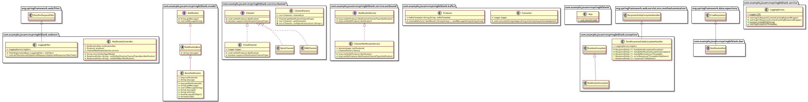

# notification-sending-system

<!-- TOC -->

- [notification-sending-system](#notification-sending-system)
  - [README](#readme)
  - [Initial client requirements and task](#initial-client-requirements-and-task)
  - [Initial breakdown and analysis](#initial-breakdown-and-analysis)
  - [Additional requirements clarifications](#additional-requirements-clarifications)
  - [Description](#description)
    - [Class diagram](#class-diagram)
    - [POSTMAN REST requests collection](#postman-rest-requests-collection)
    - [System high-level components and services](#system-high-level-components-and-services)
    - [System code base components and more technical details and functionalities](#system-code-base-components-and-more-technical-details-and-functionalities)
  - [Challenges](#challenges)
  - [Install, Setup, Running and Deployment instructions](#install-setup-running-and-deployment-instructions)
  - [Demo](#demo)
  - [Further development](#further-development)
  - [Related projects](#related-projects)
  - [References](#references)

<!-- /TOC -->

---

## README

## Initial client requirements and task

- Please see: [Initial client requirements task](Tech%20Assignment_Verification_SSE.pdf)

## Initial breakdown and analysis
  
- This is based on [Initial client requirements and task](#initial-client-requirements-and-task), please see:

  - [Initial breakdown and analysis](ANALYSIS_V1.0.md)

## Additional requirements clarifications

- Please see: [Additional requirements clarifications](ADDITIONAL_REQ_CLARIFICATION.md)

## Description

This is an extensible and scalable minimum viable product (MVP) of a message sending system .

- Tech stack:
  - Java
  - Spring Boot
  - Apache Kafka
  - Apache ZooKeeper
  - MySQL
  - Docker

1. `Requirement 1.` -  The system needs to be able to send notifications via several different channels (email,
sms, slack) and be easily extensible to support more channels in the future.

The system is able to send notifications via several different channels (email, sms, slack) and is easily extensible to support more channels in the future.

For the purposes of the MVP only the `email` channel is implemented.

The system contains `Channel` and `Notification` interfaces which allow extensibility and support of more channels and notifications in the future.
The `Channel` interface is implemented by the `EmailChannel`, `SlackChannel`, `SMSChannel` and can be implemented by more channels in the future as required.

Please see class diagram for more information:

### Class diagram



2. `Requirement 2.` The system needs to be horizontally scalable.

The system is designed to be horizontally scalable by using technologies such as `Docker`, `Docker Compose` and `Apache Kafka`.

This design allows when the system is deployed to production to be deployed to `Kubernetes` and for each component to be scaled according to load.

3. `Requirement 3.` The system must guarantee an *"at least once"* SLA for sending the message.

The system is designed to guarantee `at least once` SLA for sending messages by utilizing `Apache Kafka's` Producer functionality.
The configuraiton which allows us to achieve this is setting the `acks: 1` and `retries: 3` parameters.
Here is an excerpt from the full configuration file:

```yml
    producer:
      client-id: example
      key-serializer: org.apache.kafka.common.serialization.StringSerializer
      value-serializer: org.apache.kafka.common.serialization.StringSerializer
      # The following properties `acks: 1` and `retries: 3` allow us to achieve the desired guarantee of the system,
      # that an "at least once" SLA for sending the message, is met.
      # Please see below for more details:
      # "When this property is set to 1 you can achieve at least once delivery semantics.
      # A Kafka producer sends the record to the broker and waits for a response from the broker.
      # If no acknowledgment is received for the message sent, then the producer will retry sending the messages
      # based on a retry configuration. The retries property, by default, is set to 0;
      # make sure this is set to the desired number or Max.INT."
      # References:
      # https://dzone.com/articles/kafka-producer-delivery-semantics
      # http://kafka.apache.org/090/documentation.html#producerconfigs
      acks: 1
      retries: 3
```

Please see the full configuration file for more details:

- [kafka.yml](src/main/resources/kafka.yml)

4. `Requirement 4.` The interface for accepting notifications to be sent can be chosen on your own discretion.

For the purpose of the MVP the chosen interface is REST endpoints.

The following endpoints can be used to trigger a notification to be sent.

- `/notify/{channelType}` endpoint
  
  - Used in this format for example, where `channelType` is replaced with `email: <http://localhost:8081/notification-service/notify/email>
  - Example request:
  
      ```sh
      curl --location --request POST 'http://localhost:8081/notification-service/notify/email' \
      --header 'Content-Type: application/json' \
      --data-raw '{  
      "message": "Body of message 1."
      }'
      ```

- `/notifyAll` endpoint
  
  - Currently not implemented as per [Additional requirements clarifications](#additional-requirements-clarifications)
  - As a good practice it currently returns a REST response:

      ```sh
      501 Not Implemented

      Notify method is not implemented yet.
      ```

- You can use the [POSTMAN REST requests collection](#postman-rest-requests-collection) for demo and testing purposes.

### POSTMAN REST requests collection

- [POSTMAN REST requests collection](notification-notification-sending-system-postman.postman_collection.json)

### System high-level components and services

- Main code base
  - `notification-sending-system`
- MySQL Database
  - `notificationmysql`
- Apache Kafka
  - `kafka`
- Apache ZooKeeper
  - `zookeeper`

### System code base components and more technical details and functionalities

- `com.example.javamvnspringbtblank.dao.NotificationDao`
  - MySQL Database Data Access Object (DAO) CRUD (Create Read Update Delete) repository.

- `com.example.javamvnspringbtblank.exception.NotificationException`
  - Custom exception class.

- `com.example.javamvnspringbtblank.exception.RestResponseEntityExceptionHandler`
  - Custom exception handler.

- `com.example.javamvnspringbtblank.kafka.Consumer`
  - Kafka Consumer implementation.

- `com.example.javamvnspringbtblank.kafka.Producer`
  - Kafka Producer implementation.

- `com.example.javamvnspringbtblank.model.Notification`
  - Interface to allow extensibility and support of different kind of notifications. This interface provides a basic contract which any implementations need to adhere to.

- `com.example.javamvnspringbtblank.model.NotificationBase`
  - Abstract class to allow extensibility and support of different kind of notifications and prevent creation of notification implementations outside of this allowed package structure. This is achieved by a constructor with `default` access encapsulation.

- `com.example.javamvnspringbtblank.model.BasicNotification`
  - Concrete implementation of the `Notification` interface and `NotificationBase` abstract class abstractions.

- `com.example.javamvnspringbtblank.model.NotificationChannelType`
  - Enum type is preferred to using interfaces or other methods for containing CONSTANT values. This also allows a good mechanism for implementing a `Factory Design Pattern`, done in the `ChannelFactory.class`.

- `com.example.javamvnspringbtblank.service.channel.Channel`
  - An interface allowing for the code base to be easily extensible to support more channels in the future. It also comes with a couple of default methods which make use of the custom exception `com.example.javamvnspringbtblank.exception.NotificationException`. This is an elegant way of providing an Interface Contract and handling channels which have not provided concrete implementation yet. If they want to avoid the exceptions thrown by these default methods, they will have to honour the Interface Contract and provide concrete implementations.

- `com.example.javamvnspringbtblank.service.channel.ChannelFactory`
  - A basic implementation of a `Factory Design Pattern` for producing the relevant Channel objects based on the required type and hence providing the relevant functionality.

- `com.example.javamvnspringbtblank.service.channel.EmailChannel`
  - A concrete implementation of the `com.example.javamvnspringbtblank.service.channel.Channel` interface. `EmailChannel` makes use of the Kafka `com.example.javamvnspringbtblank.kafka.Producer` to produce the required message of type `email` and forward it to `Kafka`, so that `Kafka` in turn can forward it to any `Consumers`, listening for messages on the relevant `Kafka` topic.

- `com.example.javamvnspringbtblank.service.channel.SlackChannel`
  - A class which implements the `com.example.javamvnspringbtblank.service.channel.Channel` interface. As per [Additional requirements clarifications](#additional-requirements-clarifications) it is not required and therefore does not provide its own implementations of the methods required by the interface contract, so it inherits the interface's default methods which throw `com.example.javamvnspringbtblank.exception.NotificationException`, which is in turn handled by `com.example.javamvnspringbtblank.exception.RestResponseEntityExceptionHandler`.

- `com.example.javamvnspringbtblank.service.channel.SMSChannel`
  - A class which implements the `com.example.javamvnspringbtblank.service.channel.Channel` interface. As per [Additional requirements clarifications](#additional-requirements-clarifications) it is not required and therefore does not provide its own implementations of the methods required by the interface contract, so it inherits the interface's default methods which throw `com.example.javamvnspringbtblank.exception.NotificationException`, which is in turn handled by `com.example.javamvnspringbtblank.exception.RestResponseEntityExceptionHandler`.

- `com.example.javamvnspringbtblank.service.outbound.NotificationService`
  - An interface for `NotificationService` implementations defining a minimum set of requirements which need to be implemented.

- `com.example.javamvnspringbtblank.service.outbound.ChannelNotificationService`
  - A concrete implementation of the `com.example.javamvnspringbtblank.service.outbound.NotificationService` interface. This service provides functionality which can be triggered by the system's REST endpoints to send notifications.

- LoggingService.java

- LoggingFilter

- NotificationController

- App

- application.properties

- kafka.yml

- ChannelNotificationServiceIntegrationTest

- ChannelNotificationServiceTest

- TestUtils

- docker-compose.yml

- Dockerfile

- kafka_server_jaas.conf

- pom.xml

- setup.sql

---

## Challenges

---

## Install, Setup, Running and Deployment instructions

`/etc/hosts` file:

```sh
```

For Docker container, to be packaged well:
```shell
mvn clean package install spring-boot:repackage -DskipTests
```

```shell
docker-compose up --build --remove-orphans
```

For remote debugging in Dockerfile:

```shell
ENV JAVA_TOOL_OPTIONS -agentlib:jdwp=transport=dt_socket,server=y,suspend=n,address=*:5005 -Djava.security.egd=file:/dev/./urandom
```

For Maven help, please see:

- [Maven help](HELP.md)

---

## Demo

---

## Further development

---

## Related projects

---

## References

<https://dzone.com/articles/kafka-producer-delivery-semantics>

<http://kafka.apache.org/090/documentation.html#producerconfigs>

---
