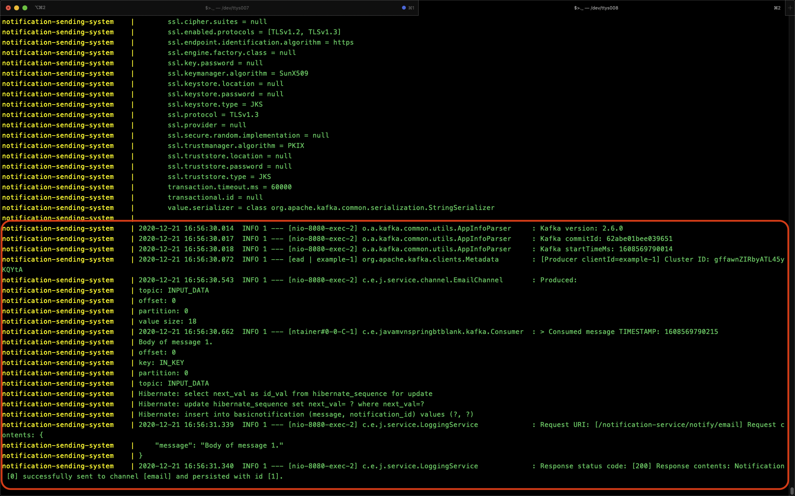
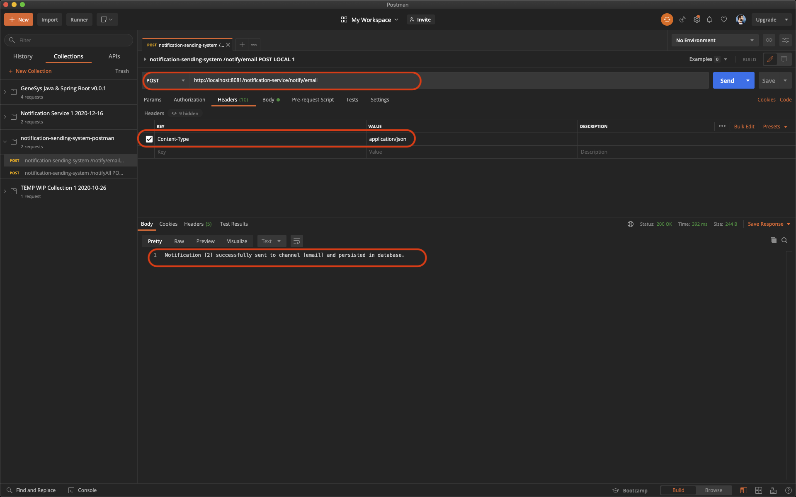

# notification-sending-system

<!-- TOC -->

- [notification-sending-system](#notification-sending-system)
  - [README](#readme)
  - [Initial client requirements and task](#initial-client-requirements-and-task)
  - [Initial breakdown and analysis](#initial-breakdown-and-analysis)
  - [Additional requirements clarifications](#additional-requirements-clarifications)
  - [Description](#description)
    - [Class diagram](#class-diagram)
    - [POSTMAN REST requests collection](#postman-rest-requests-collection)
    - [System Design high-level](#system-design-high-level)
    - [System high-level components and services](#system-high-level-components-and-services)
    - [System code base components and more technical details and functionalities](#system-code-base-components-and-more-technical-details-and-functionalities)
  - [Challenges](#challenges)
  - [Install, Setup, Running and Deployment instructions](#install-setup-running-and-deployment-instructions)
    - [Setting up the `/etc/hosts` file](#setting-up-the-etchosts-file)
    - [Building the project](#building-the-project)
    - [Running the project with `Docker Compose`](#running-the-project-with-docker-compose)
    - [Remote debugging with IntelliJ Idea CE](#remote-debugging-with-intellij-idea-ce)
    - [Maven](#maven)
  - [Working solution sending an `email` notification demo](#working-solution-sending-an-email-notification-demo)
  - [Remote debugging config demo](#remote-debugging-config-demo)
  - [Remote debugging demo](#remote-debugging-demo)
  - [Further development](#further-development)
  - [Other projects](#other-projects)
  - [scala notice processor notification service pseudo code](#scala-notice-processor-notification-service-pseudo-code)
  - [genesys-java-springboot-docker](#genesys-java-springboot-docker)
  - [References](#references)

<!-- /TOC -->

---

## README

## Initial client requirements and task

- Please see: [Initial client requirements task](Tech%20Assignment_Verification_SSE.pdf)

## Initial breakdown and analysis
  
- This is based on [Initial client requirements and task](#initial-client-requirements-and-task), please see:

  - [Initial breakdown and analysis](ANALYSIS_V1.0.md)

## Additional requirements clarifications

- Please see: [Additional requirements clarifications](ADDITIONAL_REQ_CLARIFICATION.md)

## Description

This is an extensible and scalable minimum viable product (MVP) of a message sending system .

- Tech stack:
  - Java
  - Spring Boot
  - Apache Kafka
  - Apache ZooKeeper
  - MySQL
  - Docker

1. `Requirement 1.` -  The system needs to be able to send notifications via several different channels (email,
sms, slack) and be easily extensible to support more channels in the future.

The system is able to send notifications via several different channels (email, sms, slack) and is easily extensible to support more channels in the future.

For the purposes of the MVP only the `email` channel is implemented.

The system contains `Channel` and `Notification` interfaces which allow extensibility and support of more channels and notifications in the future.
The `Channel` interface is implemented by the `EmailChannel`, `SlackChannel`, `SMSChannel` and can be implemented by more channels in the future as required.

Please see class diagram for more information:

### Class diagram


***NOTE:*** Please click on this and all subsequent images to enlarge, or open them in a new window.

2. `Requirement 2.` The system needs to be horizontally scalable.

The system is designed to be horizontally scalable by using technologies such as `Docker`, `Docker Compose` and `Apache Kafka`.

This design allows when the system is deployed to production to be deployed to `Kubernetes` and for each component to be scaled according to load.

<div id="requirement3"></div>

3. `Requirement 3.` The system must guarantee an *"at least once"* SLA for sending the message.

The system is designed to guarantee `at least once` SLA for sending messages by utilizing `Apache Kafka's` Producer functionality.
The configuration which allows us to achieve this is setting the `acks: 1` and `retries: 3` parameters for the `producer`.
Here is an excerpt from the full configuration file:

```yml
    producer:
      client-id: example
      key-serializer: org.apache.kafka.common.serialization.StringSerializer
      value-serializer: org.apache.kafka.common.serialization.StringSerializer
      # The following properties `acks: 1` and `retries: 3` allow us to achieve the desired guarantee of the system,
      # that an "at least once" SLA for sending the message, is met.
      # Please see below for more details:
      # "When this property is set to 1 you can achieve at least once delivery semantics.
      # A Kafka producer sends the record to the broker and waits for a response from the broker.
      # If no acknowledgment is received for the message sent, then the producer will retry sending the messages
      # based on a retry configuration. The retries property, by default, is set to 0;
      # make sure this is set to the desired number or Max.INT."
      # References:
      # https://dzone.com/articles/kafka-producer-delivery-semantics
      # http://kafka.apache.org/090/documentation.html#producerconfigs
      acks: 1
      retries: 3
```

Please see the full configuration file for more details:

- [kafka.yml](src/main/resources/kafka.yml)

4. `Requirement 4.` The interface for accepting notifications to be sent can be chosen on your own discretion.

For the purpose of the MVP the chosen interface is REST endpoints.

The following endpoints can be used to trigger a notification to be sent.

- `/notify/{channelType}` endpoint
  
  - Used in this format for example, where `channelType` is replaced with `email: <http://localhost:8081/notification-service/notify/email>
  - Example request:
  
      ```sh
      curl --location --request POST 'http://localhost:8081/notification-service/notify/email' \
      --header 'Content-Type: application/json' \
      --data-raw '{  
      "message": "Body of message 1."
      }'
      ```

- `/notifyAll` endpoint
  
  - Currently not implemented as per [Additional requirements clarifications](#additional-requirements-clarifications)
  - As a good practice it currently returns a REST response:

      ```sh
      501 Not Implemented

      Notify method is not implemented yet.
      ```

- You can use the [POSTMAN REST requests collection](#postman-rest-requests-collection) for demo and testing purposes.

### POSTMAN REST requests collection

- [POSTMAN REST requests collection](notification-notification-sending-system-postman.postman_collection.json)

***NOTE:*** The system provides additional functionality of persisting notifications which have gone through it, in a `MySQL database`.

### System Design high-level

This is the System Design diagram of a `scalabe`, `distributed`  messaging service system.


***NOTE:*** For the purposes of the MVP there is only one `Consumer` and it is located within the code base of the `notification-sending-system`.

The scalability and distribution of the system are achieved through:

- Docker containerization allowing to scale each component to multiple clusters/replicas/pods/containers.

- Intrinsic scalable and distributed properties of Apache Kafka in terms of clusters, topics, partitions, etc. For more information please see: <http://kafka.apache.org/090/documentation.html>


> References:
> <http://kafka.apache.org/090/documentation.html#producerconfigs>

### System high-level components and services

- Main code base
  - `notification-sending-system`
- MySQL Database
  - `notificationmysql`
- Apache Kafka
  - `kafka`
- Apache ZooKeeper
  - `zookeeper`

### System code base components and more technical details and functionalities

- `com.example.javamvnspringbtblank.dao.NotificationDao`
  - MySQL Database Data Access Object (DAO) CRUD (Create Read Update Delete) repository.

- `com.example.javamvnspringbtblank.exception.NotificationException`
  - Custom exception class.

- `com.example.javamvnspringbtblank.exception.RestResponseEntityExceptionHandler`
  - Custom exception handler.

- `com.example.javamvnspringbtblank.kafka.Consumer`
  - Kafka Consumer implementation.

- `com.example.javamvnspringbtblank.kafka.Producer`
  - Kafka Producer implementation.

- `com.example.javamvnspringbtblank.model.Notification`
  - Interface to allow extensibility and support of different kind of notifications. This interface provides a basic contract which any implementations need to adhere to.

- `com.example.javamvnspringbtblank.model.NotificationBase`
  - Abstract class to allow extensibility and support of different kind of notifications and prevent creation of notification implementations outside of this allowed package structure. This is achieved by a constructor with `default` access encapsulation.

- `com.example.javamvnspringbtblank.model.BasicNotification`
  - Simple POJO concrete implementation of the `Notification` interface and `NotificationBase` abstract class abstractions. Includes annotations for mapping to database tables and fields.

- `com.example.javamvnspringbtblank.model.NotificationChannelType`
  - Enum type is preferred to using interfaces or other methods for containing CONSTANT values. This also allows a good mechanism for implementing a `Factory Design Pattern`, done in the `ChannelFactory.class`.

- `com.example.javamvnspringbtblank.service.channel.Channel`
  - An interface allowing for the code base to be easily extensible to support more channels in the future. It also comes with a couple of default methods which make use of the custom exception `com.example.javamvnspringbtblank.exception.NotificationException`. This is an elegant way of providing an Interface Contract and handling channels which have not provided concrete implementation yet. If they want to avoid the exceptions thrown by these default methods, they will have to honour the Interface Contract and provide concrete implementations.

- `com.example.javamvnspringbtblank.service.channel.ChannelFactory`
  - A basic implementation of a `Factory Design Pattern` for producing the relevant Channel objects based on the required type and hence providing the relevant functionality.
  - The `ChannelFactory` is configured with supported channels from the `application.properties` configuration file, thus making it more flexible and extensible for the future.

- `com.example.javamvnspringbtblank.service.channel.EmailChannel`
  - A concrete implementation of the `com.example.javamvnspringbtblank.service.channel.Channel` interface. `EmailChannel` makes use of the Kafka `com.example.javamvnspringbtblank.kafka.Producer` to produce the required message of type `email` and forward it to `Kafka`, so that `Kafka` in turn can forward it to any `Consumers`, listening for messages on the relevant `Kafka` topic.

- `com.example.javamvnspringbtblank.service.channel.SlackChannel`
  - A class which implements the `com.example.javamvnspringbtblank.service.channel.Channel` interface. As per [Additional requirements clarifications](#additional-requirements-clarifications) it is not required and therefore does not provide its own implementations of the methods required by the interface contract, so it inherits the interface's default methods which throw `com.example.javamvnspringbtblank.exception.NotificationException`, which is in turn handled by `com.example.javamvnspringbtblank.exception.RestResponseEntityExceptionHandler`.

- `com.example.javamvnspringbtblank.service.channel.SMSChannel`
  - A class which implements the `com.example.javamvnspringbtblank.service.channel.Channel` interface. As per [Additional requirements clarifications](#additional-requirements-clarifications) it is not required and therefore does not provide its own implementations of the methods required by the interface contract, so it inherits the interface's default methods which throw `com.example.javamvnspringbtblank.exception.NotificationException`, which is in turn handled by `com.example.javamvnspringbtblank.exception.RestResponseEntityExceptionHandler`.

- `com.example.javamvnspringbtblank.service.outbound.NotificationService`
  - An interface for `NotificationService` implementations defining a minimum set of requirements which need to be implemented.

- `com.example.javamvnspringbtblank.service.outbound.ChannelNotificationService`
  - A concrete implementation of the `com.example.javamvnspringbtblank.service.outbound.NotificationService` interface. This service provides functionality which can be triggered by the system's REST endpoints to send notifications.

- `com.example.javamvnspringbtblank.service.LoggingService`
  - An utility service to facilitate logging by encompassing all common logging related logic.

- `com.example.javamvnspringbtblank.webrest.LoggingFilter`
  - A servlet level filter to capture and log all incoming REST requests and outgoing REST responses. It makes use of `com.example.javamvnspringbtblank.service.LoggingService`.

- `com.example.javamvnspringbtblank.webrest.NotificationController`
  - A REST controller providing the application with REST endpoints.
  - It makes use of `com.example.javamvnspringbtblank.service.outbound.ChannelNotificationService` to send the relevant notifications.
  - It makes use of `com.example.javamvnspringbtblank.dao.NotificationDao` to persist, in the `MySQL database`, any notifications which have gone through the system.

- `com.example.javamvnspringbtblank.App`
  - The application's main class and main entry point for start up.

- `application.properties`
  - File containing the applications configuration for:
    - Custom configuration for supported channels
    - Logging
    - Databases
    - Kafka
    - Other etc. can be added in the future
  - ***NOTE:*** Contains auth credentials for demo purposes. Credentials for running in a real, deployed-to-live, scenario to be stored in a secure manner, such as a `truststore` or `Vault`.

- `kafka.yml`
  - Apache Kafka configuration file.
  - Contains configuration for the Kafka `Producers` and `Consumers`, please see [Requirement 3](#requirement3) for more details.

- `com.example.javamvnspringbtblank.ChannelNotificationServiceIntegrationTest`
  - Integration tests.
  - ***NOTE:*** The integration tests require a running `MySQL` database in a `Docker` container named `notificationmysql`. This is because they test of actual `"integration"` and require a database to write to.

- `com.example.javamvnspringbtblank.ChannelNotificationServiceTest`
  - Unit tests.

- `com.example.javamvnspringbtblank.TestUtils`
  - A test utility class for encompassing all common test related logic.

- `docker-compose.yml`
  - Docker Compose configuration.

- `Dockerfile`
  - Docker container file for the `notification-sending-system`.
  - Also provides remote debugging capabilities for the code running in the container.

- `kafka_server_jaas.conf`
  - `Apache Kafka` auth credentials for demo purposes. Credentials for running in a real, deployed-to-live, scenario to be stored in a secure manner, such as a `truststore` or `Vault`.

- `pom.xml`
  - The application's POM file containing all of the necessary `Maven` dependencies.

- `setup.sql`
  - A small `SQL` script to do the required set up for the MySQL database in the `Docker` container.

---

## Challenges

A lot of `research`, `time` and `experiments` went into overcoming the following challenges:

- This is the first time setting up `Apache Kafka` in a distributed environment with `Docker` and there were plenty of challenges in building and getting all services to talk to each other and play nicely.

- Debugging in a distributed environment with `Docker` and `Docker Compose`.

Some of the encountered problems and solutions are described well as scenarios in this website: <https://www.confluent.io/blog/kafka-client-cannot-connect-to-broker-on-aws-on-docker-etc/>

Pictures describing encountered problems:


Picture describing current solution:


> References:
> <https://www.confluent.io/blog/kafka-client-cannot-connect-to-broker-on-aws-on-docker-etc/>

---

## Install, Setup, Running and Deployment instructions

Prerequisits:

- Computer set up with relevant specs
- Java
- Spring Boot
- Maven
- Docker
- Docker Compose
- IntelliJ Idea CE
  - Docker plug-in

### Setting up the `/etc/hosts` file

The following is required to allow the Docker containers to communicate while running on your local machine.

Append the following to the end of your `/etc/hosts` file:

```sh
127.0.0.1       localhost
255.255.255.255 broadcasthost
::1             localhost
127.0.0.1 zookeeper
127.0.0.1 kafka
127.0.0.1 notification-sending-system
127.0.0.1 notificationmysql
```

### Building the project

- For the code base to be packaged well run the following command, in your terminal, in the root folder of the project:

```shell
mvn clean package install spring-boot:repackage
```

***NOTE:*** The integration tests require a running `MySQL` database in a `Docker` container named `notificationmysql`. This is because they test of actual `"integration"` and require a database to write to.

***NOTE:*** This command is required because Spring Boot generates it's own `MANIFEST` file and if the above command is not run, it will not end up in the final `jar` file and `Docker` will fail to build the container.

- To skip running the tests run:

```shell
mvn clean package install spring-boot:repackage -DskipTests
```

### Running the project with `Docker Compose`

- Run the following Docker Compose command in your terminal, in the root folder of the project:

```shell
docker-compose up --build --remove-orphans
```

### Remote debugging with IntelliJ Idea CE

- For remote debugging add the following line in the `Dockerfile`:

```shell
ENV JAVA_TOOL_OPTIONS -agentlib:jdwp=transport=dt_socket,server=y,suspend=n,address=*:5005 -Djava.security.egd=file:/dev/./urandom
```

### Maven

For Maven help, please see:

- [Maven help](HELP.md)

---

## Working solution sending an `email` notification demo








## Remote debugging config demo


## Remote debugging demo


---

## Further development

If the project is approved for the next stage, further time and resources should be provided for it.

For this project to be advanced to the next level, the following should be taken into consideration and evaluated as requirements for further development.

- Implement the next channels, `SlackChannel`, `SMSChannel`, and have separate Kafka topics for their production/consumption
- Implement separate `profiles` for different environments, such as `integration`, `testing` and `production`
- Run the following services `notification-sending-system`,`notificationmysql`,`kafka`, `zookeeper` in separate containers, managed in `Kubernetes`, so they can be scaled and managed more easily
- JSON serialization/deserialization for messages
- More Testing
  - More Unit tests to cover unhappy paths and edge cases
  - More Integration tests to cover unhappy paths and edge cases
  - Load Testing
- Security
  - Credential store such as a custom `Trustsore` or `Vault`
- Performance
  - Research if custom thread pool is needed for vertical performance scalability
- Structured Logging in `JSON` format so that it can be fed into systems such as `Splunk`
- More CRUD capabilities for querying already persisted data
- Distributed Tracing with `Sleuth` and `Zipkin` - indispensible if this system is to be part of a larger distributed system
- Add metrics and monitoring
- Static graphical User Interface (UX) using `Thymeleaf` or a dynamic one using `ReactJS` or `AngularJS` if a dynamic one is required. This can be used for manually triggering a notification.
- Add more documentation
  - Add Swagger API documentation
- More resilience and availability through supporting more queue technologies both inbound and outbound, such as:
  - Kafka and/or AWS SNS + SQS
- Add `Lombok` and `Auto Value` to reduce Java boilerplate
- Add common formatting and linting for the whole team
- Add parent pom file
- Add `Maven Enforcer` plug-in to enforce and manage dependencies versions across the team

---

## Other projects

Please check out some of my other projects.

## scala notice processor notification service pseudo code

[blueprint scala notice processor notification service pseudo code wip temp example 2018-10-14](https://github.com/atkuzmanov/blueprint-scala-notice-processor-notification-service-pseudo-code-2018-10-14)

This project has (in `pseudo code`):

- [Custom implementation of retry logic for a block of code](https://github.com/atkuzmanov/blueprint-scala-notice-processor-notification-service-pseudo-code-2018-10-14/blob/master/src/main/scala/exampleRetries/ExampleRetryABlockOfCodeXTimes.scala)

- [Example Service making use of custom retry logic](https://github.com/atkuzmanov/blueprint-scala-notice-processor-notification-service-pseudo-code-2018-10-14/blob/master/src/main/scala/exampleOneDCDown/ExampleDataCentreVerificationService.scala)

- [Custom Concurrency Capacity Manager](https://github.com/atkuzmanov/blueprint-scala-notice-processor-notification-service-pseudo-code-2018-10-14/blob/master/src/main/scala/exampleCapacity/CapacityManagerExample.scala)

- [Example Service making use of the Custom Concurrency Capacity Manager](https://github.com/atkuzmanov/blueprint-scala-notice-processor-notification-service-pseudo-code-2018-10-14/blob/master/src/main/scala/exampleCapacity/MessageProcessorExample.scala)

- [Custom Thread Pool](https://github.com/atkuzmanov/blueprint-scala-notice-processor-notification-service-pseudo-code-2018-10-14/blob/master/src/main/scala/exampleCapacity/CustomExecutionContextWithCustomThreadPool.scala)

## genesys-java-springboot-docker

[genesys-java-springboot-docker](https://github.com/atkuzmanov/genesys-java-springboot-docker)

The project comes incorporating or pre-configured to be compatible with the following technologies:

- [Java](https://www.java.com/en/)
- [Spring](https://spring.io/)
- [Spring Boot](https://spring.io/projects/spring-boot)
    - [Spring Cloud](https://spring.io/projects/spring-cloud)
- [Aspect Oriented Programming (AOP)](https://en.wikipedia.org/wiki/Aspect-oriented_programming)
    - [Spring AOP](https://docs.spring.io/spring-framework/docs/4.3.12.RELEASE/spring-framework-reference/htmlsingle/#overview-aop-instrumentation)
    - [AspectJ](https://www.eclipse.org/aspectj/)
- [Web & REST](https://en.wikipedia.org/wiki/Representational_state_transfer)
    - [Spring MVC](https://docs.spring.io/spring-framework/docs/current/reference/html/web.html)
        - [Controllers](https://docs.spring.io/spring-framework/docs/current/reference/html/web.html#mvc-controller)
        - [Filters](https://docs.spring.io/spring-framework/docs/current/reference/html/web.html#filters)
        - [Exception Handling](https://docs.spring.io/spring-framework/docs/3.2.x/spring-framework-reference/html/mvc.html#mvc-exceptionhandlers)
    - [Thymeleaf templates](https://www.thymeleaf.org/documentation.html)
        - [HTML](https://www.w3schools.com/html/html_intro.asp)
        - [CSS](https://www.w3schools.com/css/css_intro.asp)
- [Testing](https://en.wikipedia.org/wiki/Software_testing)
    - [Spring Boot Test](https://docs.spring.io/spring-boot/docs/2.1.5.RELEASE/reference/html/boot-features-testing.html)
        - [JUnit](https://junit.org/junit5/)
        - [Unit Testing](https://en.wikipedia.org/wiki/Unit_testing#:~:text=Unit%20tests%20are%20typically%20automated,an%20individual%20function%20or%20procedure.)
        - [Integration Testing](https://en.wikipedia.org/wiki/Integration_testing)
- [Spring Data](https://spring.io/projects/spring-data)
    - [MySQL](https://dev.mysql.com/doc/connector-j/8.0/en/)
    - [JPA](https://en.wikipedia.org/wiki/Jakarta_Persistence)
    - [DAO](https://en.wikipedia.org/wiki/Data_access_object)
- [Logging](https://en.wikipedia.org/wiki/Log_file)
    - [Structured Logging in JSON format](https://medium.com/@krishankantsinghal/structured-logging-why-and-how-to-achieve-in-java-33974d22accb)
    - [Logback](http://logback.qos.ch/)
    - [SLF4J](http://www.slf4j.org/)
        - [MDC](http://www.slf4j.org/api/org/slf4j/MDC.html)
    - [Logstash](https://github.com/elastic/logstash)
- [Distributed Tracing](https://docs.lightstep.com/docs/understand-distributed-tracing)
    - [Spring Cloud Sleuth](https://spring.io/projects/spring-cloud-sleuth)
    - [Zipkin](https://zipkin.io/)
- [Apache Maven](https://maven.apache.org/index.html)
    - [Apache Maven Enforcer plugin](https://maven.apache.org/enforcer/maven-enforcer-plugin/)
- [Apache Tomcat](http://tomcat.apache.org/)
- [Design Patterns](https://www.oodesign.com/)
    - [Builder Design Pattern](https://www.oodesign.com/builder-pattern.html)
- [Docker](https://www.docker.com/)
    - [Docker-compose](https://docs.docker.com/compose/)
- [Lombok](https://www.projectlombok.org/)
- [Google Guava](https://github.com/google/guava)

Also please feel free to checkout my GitHub for other cool bits and bobs:

- [atkuzmanov](https://github.com/atkuzmanov)

---

## References

<http://kafka.apache.org/090/documentation.html#producerconfigs>

<https://www.confluent.io/blog/kafka-client-cannot-connect-to-broker-on-aws-on-docker-etc/>

<https://dzone.com/articles/kafka-producer-delivery-semantics>

<https://github.com/atkuzmanov>

---
